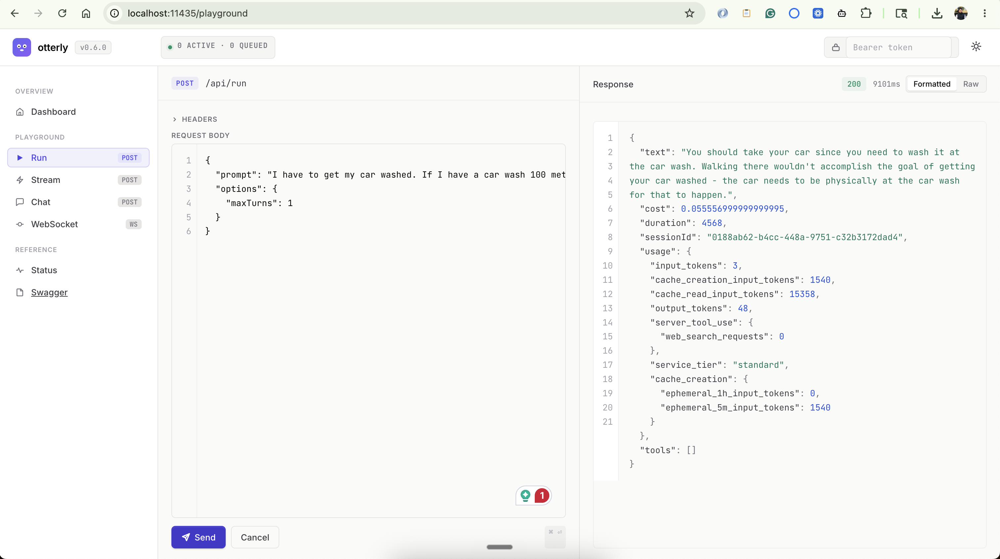
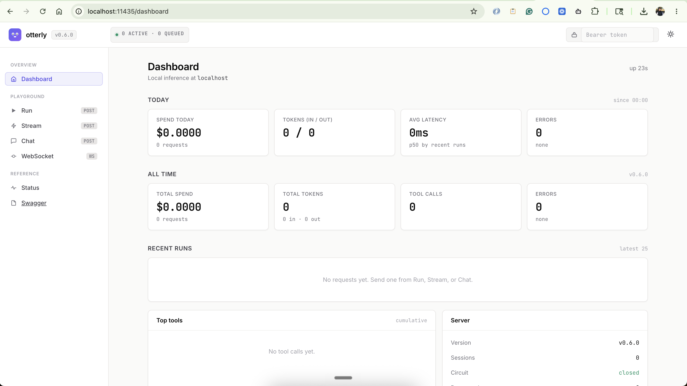

<p align="center">
  <h1 align="center">otterly</h1>
  <p align="center"><strong>Ollama for Claude.</strong> Use your Claude Code subscription as a local AI API. For free.</p>
</p>

<p align="center">
  <a href="https://otterly.josharsh.com">otterly.josharsh.com</a> · <a href="https://www.npmjs.com/package/otterly">npm</a> · <a href="https://github.com/josharsh/otterly">github</a>
</p>

<p align="center">
  <a href="https://www.npmjs.com/package/otterly"></a>
  <a href="https://www.npmjs.com/package/otterly"></a>
  <a href="https://github.com/josharsh/otterly/blob/main/LICENSE"></a>
  <a href="https://nodejs.org"></a>
</p>

<p align="center">
  
</p>
<p align="center"><sub><code>otterly serve</code> → <a href="http://localhost:11434/playground"><code>localhost:11434/playground</code></a> to poke the API, or <a href="http://localhost:11434/dashboard"><code>/dashboard</code></a> for live spend, tokens, latency, and tool usage.</sub></p>

---

## The pitch in one breath

You already pay **\$20–\$200/month** for Claude Code. Then you build a side project, a script, a tiny agent, and Anthropic charges you **again** per token via the API. That's double-paying for the same brain.

**Otterly fixes that.** It turns your existing Claude Code subscription into a local, OpenAI-compatible API, exactly like Ollama does for open-source models, powered by the Claude that you're already paying for.

```bash
npx otterly serve
```

```
  otterly: local inference server
  ──────────────────────────────────────
  OpenAI compat : http://localhost:11434/v1/chat/completions
  Playground    : http://localhost:11434/playground
  Ready. Point any OpenAI client at it.
```

Same port as Ollama. Same OpenAI-compatible API. Zero per-token cost. No API keys.

---

## Three ways to use it

| | **Library** | **CLI server** | **Embedded server** |
|---|---|---|---|
| How | `import { claude } from "otterly"` | `npx otterly serve` | `await startApiServer({ port })` |
| Best for | Node.js scripts & agents | Any language, any tool | Bundling the server into your app |
| Network | None, in-process | localhost HTTP/WS | localhost HTTP/WS |
| Analogy | Direct function call | `ollama serve` | `ollama` as a library |

Pick one. Mix all three.

---

## The without / with comparison

```typescript
// Without otterly: pay Anthropic twice
import Anthropic from "@anthropic-ai/sdk";
const client = new Anthropic({ apiKey: "sk-ant-..." });          // $3 / MTok in
const res = await client.messages.create({                        // $15 / MTok out
  model: "claude-sonnet-4-20250514",
  messages: [{ role: "user", content: "Fix the failing tests" }],
});
```

```typescript
// With otterly (library): direct, in-process, $0
import { claude } from "otterly";
const result = await claude.run("Fix the failing tests", { cwd: "./app" });
console.log(result.text, result.cost);
```

```typescript
// With otterly (server): your existing OpenAI SDK, any language, $0
import OpenAI from "openai";
const ai = new OpenAI({ baseURL: "http://localhost:11434/v1", apiKey: "unused" });
const res = await ai.chat.completions.create({
  model: "claude-sonnet-4-20250514",
  messages: [{ role: "user", content: "Fix the failing tests" }],
});
```

That's the whole product. Keep reading if you want details.

---

## Install

```bash
npm install otterly
```

You also need Claude Code installed and signed in. Otterly auto-detects npm installs, Homebrew, and standalone binaries. Anything that gives you a working `claude` command.

```bash
# Verify
claude --version
```

---

## Get your subscription back.

> *"Claude Code subscribers can no longer use their Claude subscription limits for third-party harnesses including OpenClaw."*
> [TechCrunch](https://techcrunch.com/2026/04/04/anthropic-says-claude-code-subscribers-will-need-to-pay-extra-for-openclaw-support/), April 4, 2026

If you use **OpenClaw**, this is the section that pays for otterly.

On **April 4, 2026**, Anthropic severed the direct path between OpenClaw and your Claude Code subscription. Overnight, OpenClaw users had three new (worse) options: buy extra usage bundles, supply a separate Anthropic API key at full pay-per-token rates, or drain a small parallel "Agent SDK credit" pool. Heavy users reported bills jumping up to **50× their previous monthly outlay**. The OpenClaw author publicly called it a betrayal.

otterly is the routing layer. OpenClaw talks to `localhost:11434`. otterly spawns your authenticated `claude` CLI, which is Anthropic's own product and still allowed to use your subscription, and the request arrives at the exact destination OpenClaw was locked out of. No extra bundles, no API key, no credit-pool draining. Same model, same brain, same subscription.

### Three steps. Then OpenClaw is yours again.

```bash
# 1. install Claude Code on the same machine, sign in once
npm i -g @anthropic-ai/claude-code
claude   # browser-based login, persists after

# 2. install + run otterly
npm i -g otterly
otterly serve   # listens on localhost:11434
```

```json5
// 3. add otterly as a model provider in your OpenClaw config
{
  agents: {
    defaults: { model: { primary: "otterly/claude-sonnet-4-20250514" } },
  },
  models: {
    providers: {
      otterly: {
        baseUrl: "http://localhost:11434/v1",
        apiKey: "unused",
        api: "openai-completions",
        timeoutSeconds: 600,
        models: [{
          id: "claude-sonnet-4-20250514",
          name: "Claude Sonnet 4 (via subscription)",
          input: ["text"],
          cost: { input: 0, output: 0, cacheRead: 0, cacheWrite: 0 },
          contextWindow: 200000,
          maxTokens: 8192,
        }],
      },
    },
  },
}
```

```bash
openclaw models set otterly/claude-sonnet-4-20250514
```

That's the whole patch. Every OpenClaw call now lands on your Claude Code subscription via the local `claude` CLI. **The Agent SDK credit pool never moves, no API-key meter ticks, no extra-usage bundles get consumed.** Watch your Anthropic dashboard. The only thing that moves is your normal Claude Code subscription usage.

> **Running headless?** (Raspberry Pi, EC2, a container.) Run `claude` once over an interactive SSH session to complete the browser login. The token persists. Then run `otterly serve` as a systemd user service. Same pattern as any long-lived daemon.

### Best configuration for OpenClaw

The defaults work fine on a developer laptop. On a Pi or any small machine, four dials make Friday feel instant instead of flaky.

**Match concurrency to the box.** Each `claude` spawn uses about 1–2 GB of RAM and a full CPU core while it runs. On a Pi or a 2-vCPU VPS, set `--max-concurrent 2`. On a 16 GB laptop the default of `5` is fine. Going higher than your real parallelism mostly creates queue contention.

**Raise the queue timeout for slow first spawns.** Claude Code's first cold spawn can take 20–30 seconds when the OpenClaw prompt is large (workspace files, skills, tool schemas). Set `--queue-timeout 300` so a burst of concurrent OpenClaw cron jobs does not 408 itself into a death loop while waiting for a worker slot.

**Use otterly 0.5.0 or newer.** Earlier versions silently dropped streaming response text when otterly was driving the `claude` CLI binary (the common install path). OpenClaw uses `stream: true`. If you see *"Agent couldn't generate a response"* on a turn that should obviously work, you are on an older otterly. Upgrade.

**Run otterly as a system service, not a tmux pane.** Drop this into `~/.config/systemd/user/otterly.service`:

```ini
[Unit]
Description=otterly local inference server
After=network-online.target

[Service]
ExecStart=/usr/bin/node /home/youruser/.npm-global/bin/otterly serve --port 11434 --max-concurrent 2 --queue-timeout 300
Restart=always
RestartSec=5
Environment=HOME=/home/youruser
Environment=PATH=/usr/bin:/home/youruser/.npm-global/bin

[Install]
WantedBy=default.target
```

Then:

```bash
systemctl --user enable --now otterly.service
loginctl enable-linger youruser     # survives reboot without a login
```

**Sanity check before flipping the default model.** Once `openclaw.json` is patched, test the new provider before pointing all of OpenClaw at it:

```bash
openclaw capability model run --model otterly/claude-sonnet-4-20250514 --prompt "ping"
```

If that returns text in a few seconds, you are good: `openclaw models set otterly/claude-sonnet-4-20250514`. If it hangs, `curl http://localhost:11434/api/status` tells you exactly which queue slot is stuck.

---

## Plug otterly into your coding tool

Anything that speaks the OpenAI Chat Completions API can use otterly as a provider. Run `otterly serve` once, then drop one of these snippets in.

### Cline (VS Code extension)

In Cline's settings (Cmd-Shift-P → *Cline: Open Settings*), pick **OpenAI Compatible** as the API provider, then:

| Field | Value |
|---|---|
| Base URL | `http://localhost:11434/v1` |
| API Key | `unused` (any non-empty string) |
| Model ID | `claude-sonnet-4-20250514` |

Cline streams by default — otterly handles SSE with keepalives so cold spawns don't time out the extension.

### Cursor

Settings → **Models** → toggle **Override OpenAI Base URL**:

```
http://localhost:11434/v1
```

Set API Key to anything (e.g. `unused`), then add `claude-sonnet-4-20250514` to *Model Names*. Cursor will call otterly for chat, autocomplete, and Composer.

### Continue (`~/.continue/config.json`)

```json
{
  "models": [
    {
      "title": "Claude Sonnet 4 (via otterly)",
      "provider": "openai",
      "model": "claude-sonnet-4-20250514",
      "apiBase": "http://localhost:11434/v1",
      "apiKey": "unused"
    }
  ]
}
```

`provider: "openai"` is intentional — Continue's OpenAI provider speaks the same chat-completions shape otterly serves.

### Aider

```bash
export OPENAI_API_BASE=http://localhost:11434/v1
export OPENAI_API_KEY=unused
aider --model openai/claude-sonnet-4-20250514
```

The `openai/` prefix tells Aider to use the OpenAI-compatible path. Add to your shell profile to make it permanent.

### LiteLLM / LangChain / anything else

Same pattern everywhere: point the base URL at `http://localhost:11434/v1`, send any non-empty API key, name the model `claude-sonnet-4-20250514`. If your client talks to OpenAI today, it talks to otterly with one config change.

---

## Mode 1: Library, in-process, no server

Just import and call. Perfect for Node scripts, custom agents, cron jobs, build tools.

```typescript
import { claude } from "otterly";

// One-shot
const result = await claude.run("Add validation to user.ts", { cwd: "./app" });
console.log(result.text);   // assistant reply
console.log(result.cost);   // USD cost for this turn (tracked from Claude Code)
console.log(result.tools);  // every tool call Claude made

// Stream tokens
for await (const event of claude.stream("Refactor auth", { cwd: "." })) {
  if (event.type === "text_delta") process.stdout.write(event.delta);
  if (event.type === "tool_use") console.log(`\n[using ${event.tool}]`);
}

// Multi-turn session. Context persists in-memory, no server.
const session = claude.session({ cwd: "./app" });
await session.send("Create a REST API");
await session.send("Now add auth to it");   // remembers the API you just built
session.close();
```

Sessions run entirely in-process. No WebSocket. No HTTP. The async generator stays alive between `send()` calls and keeps Claude's working context warm. As lightweight as a function call.

---

## Mode 2: CLI server, the Ollama experience

When you want one running daemon that **any tool, any language, any framework** can talk to.

```bash
npx otterly serve
```

That's it. Now you have an OpenAI-compatible API on `localhost:11434`. Point anything at it:

```typescript
// TypeScript with the OpenAI SDK
import OpenAI from "openai";
const ai = new OpenAI({ baseURL: "http://localhost:11434/v1", apiKey: "unused" });
const res = await ai.chat.completions.create({
  model: "claude-sonnet-4-20250514",
  messages: [{ role: "user", content: "Write a haiku about otters" }],
});
```

```python
# Python with the OpenAI SDK
from openai import OpenAI
ai = OpenAI(base_url="http://localhost:11434/v1", api_key="unused")
res = ai.chat.completions.create(
  model="claude-sonnet-4-20250514",
  messages=[{"role": "user", "content": "Write a haiku about otters"}],
)
```

```bash
# Anything that speaks HTTP. curl, your shell, your dog.
curl -X POST http://localhost:11434/v1/chat/completions \
  -H "Content-Type: application/json" \
  -d '{
    "model": "claude-sonnet-4-20250514",
    "messages": [{"role": "user", "content": "Hello"}]
  }'
```

It works in Cursor, Continue, Aider, Open WebUI, LiteLLM, LangChain, llamafile UIs, your own clients. Anything with a `baseURL` field. If it talks to OpenAI, it talks to otterly.

Open the **playground** at [http://localhost:11434/playground](http://localhost:11434/playground) to poke the API from your browser, or the **dashboard** at [http://localhost:11434/dashboard](http://localhost:11434/dashboard) to see live spend, latency, and tool usage.

<p align="center">
  
</p>

---

## Speak Ollama, not just OpenAI

otterly listens on port `11434` *and* answers Ollama's own API — so Ollama-only
tools (Open WebUI's native connection, Raycast, oterm, homelab dashboards) that
auto-discover a local Ollama by polling `GET /api/tags` find otterly with **zero
config** and list your Claude models in their picker.

```bash
# Discovery — exactly what Ollama tools hit on startup
curl http://localhost:11434/api/tags

# Ollama-native chat (NDJSON stream, like `ollama run`)
curl http://localhost:11434/api/chat -d '{
  "model": "claude-sonnet-4-20250514",
  "messages": [{ "role": "user", "content": "Write a haiku about otters" }]
}'
```

Point any tool that expects an Ollama endpoint at `http://localhost:11434` and it
just works. `OLLAMA_HOST=http://localhost:11434` is all most of them need.

## Function calling (OpenAI tools)

Send OpenAI-format `tools` and otterly returns real `tool_calls` with
`finish_reason: "tool_calls"` — so agentic clients (Cline, Aider, your own
scripts) get the structured function calls they expect. **Your** code runs the
function and sends the result back as a `role: "tool"` message, exactly like the
OpenAI API. While a request carries `tools`, otterly disables Claude's own
built-in tools, so it never touches your filesystem or shell — the functions are
yours to execute.

```typescript
const res = await ai.chat.completions.create({
  model: "claude-sonnet-4-20250514",
  messages: [{ role: "user", content: "What's the weather in Paris?" }],
  tools: [{
    type: "function",
    function: {
      name: "get_weather",
      description: "Get current weather for a city",
      parameters: { type: "object", properties: { city: { type: "string" } }, required: ["city"] },
    },
  }],
});
// res.choices[0].message.tool_calls → [{ function: { name: "get_weather", arguments: '{"city":"Paris"}' } }]
```

## Mode 3: Embedded server, programmatic, no CLI

Run the full HTTP + WebSocket server **inside your own Node app**. Same endpoints, same playground, same WebSocket sessions, but no separate process to babysit.

```typescript
import { startApiServer } from "otterly";

const handle = await startApiServer({
  port: 11434,
  workingDir: "./my-project",
  maxConcurrent: 5,
});

// handle.server   → Node http.Server
// handle.wss      → WebSocketServer
// handle.port     → bound port
// handle.shutdown → graceful drain + close

// later, on app exit
await handle.shutdown(10_000);
```

This is exactly what `npx otterly serve` runs under the hood. Bundle it inside an Electron app, an internal dev tool, a Tauri sidecar, a Cloudflare-style edge worker. Anything that benefits from an AI endpoint without managing a second process.

---

## What you get with the server

| Endpoint | Format | What it's for |
|---|---|---|
| `POST /v1/chat/completions` | OpenAI | Drop-in for any OpenAI client/SDK (incl. function calling) |
| `GET /v1/models` | OpenAI | Model list — clients probe this on startup |
| `POST /api/chat` | Ollama | Ollama-native chat (NDJSON stream) |
| `POST /api/generate` | Ollama | Ollama-native completion (NDJSON stream) |
| `GET /api/tags` | Ollama | Model discovery — Ollama-only tools poll this to find otterly |
| `POST /api/show` | Ollama | Model metadata (context length, capabilities) |
| `POST /api/run` | JSON | Native one-shot with cost + tool logs |
| `POST /api/stream` | NDJSON | Streaming with rich events |
| `WS /ws` | WebSocket | Persistent multi-turn sessions |
| `GET /dashboard` | HTML | Live spend, latency, recent runs, tool usage |
| `GET /playground` | HTML | Interactive API explorer in your browser |
| `GET /api/status` | JSON | Health + queue stats |
| `GET /api/metrics` | JSON | Today + lifetime usage, recent runs, top tools |
| `GET /swagger.json` | OpenAPI 3.0 | Full spec. Generate a client in any language. |

Plus all the boring-but-essential stuff:

- **Concurrency control.** Request queue prevents fork-bombing your machine.
- **Rate limiting.** Per-IP token bucket, configurable.
- **Circuit breaker.** Bails out on cascading Claude Code failures.
- **Auth.** Set `OTTERLY_API_KEY` to require `Bearer` tokens.
- **Graceful shutdown.** Drains in-flight requests before exiting.
- **CORS.** Works straight from the browser.

---

## Server config

```bash
npx otterly serve --port 11434 --dir ./project --max-concurrent 3
```

| Flag | Default | |
|---|---|---|
| `-p, --port` | `11434` | Port to listen on |
| `-d, --dir` | cwd | Working directory Claude runs in |
| `--max-concurrent` | `5` | Parallel Claude processes |
| `--max-queue` | `50` | Max queued requests |
| `--queue-timeout` | `120` | Seconds a request may wait in the queue before 408 |
| `--rate-limit` | `60` | Requests/min per client |

Programmatic options on `startApiServer()` mirror the flags, plus `requestTimeoutMs`, `streamTimeoutMs`, and `queueTimeoutMs`. Set `OTTERLY_API_KEY` in the environment to require Bearer auth.

---

## Library API at a glance

```typescript
import { claude, ClaudeEngine, READONLY, AUTOPILOT } from "otterly";

// One-shot
const result = await claude.run(prompt, options);
// → { text, cost, duration, sessionId, usage, tools }

// Streaming
for await (const event of claude.stream(prompt, options)) {
  // event.type: text_delta | tool_use | tool_result | system | result | error
}

// Multi-turn session (in-process)
const session = claude.session(options);
await session.send(message);   // → AgentResult
session.close();

// Custom engine with defaults
const engine = new ClaudeEngine({ model: "claude-sonnet-4-20250514", maxTurns: 10 });

// Permission modes
await claude.run(prompt, { permissionMode: READONLY });   // read-only
await claude.run(prompt, { permissionMode: AUTOPILOT });  // full auto

// Embedded server
import { startApiServer } from "otterly";
const handle = await startApiServer({ port: 11434 });
```

---

## Why this is allowed to exist

Otterly is a **transport layer**. It does not jailbreak Claude, does not bypass any usage limits, does not redistribute model weights, does not store your prompts. Every request flows through your **own** authenticated Claude Code installation, subject to your subscription's normal limits.

What you save is the *second meter*: the per-token API bill on top of the subscription you already pay.

Why is it called "otterly"? Because otters carry their tools with them, and your local Claude already has all the tools it needs. Also because the domain was available.

---

## Requirements

- **Node.js 18+**
- **Claude Code** installed and signed in (`claude --version` to confirm)
- An active Claude subscription (Pro, Max, or Team)

---

## Contributing

PRs and issues welcome at [github.com/josharsh/otterly](https://github.com/josharsh/otterly). Especially interested in:

- More language SDK examples (Go, Rust, Elixir)
- Integration recipes for Cursor / Continue / Aider / Open WebUI
- Bugs from running it in production-ish environments

---

## License

MIT. Use it for anything, ship it anywhere, don't blame me when an otter gets in your codebase.
